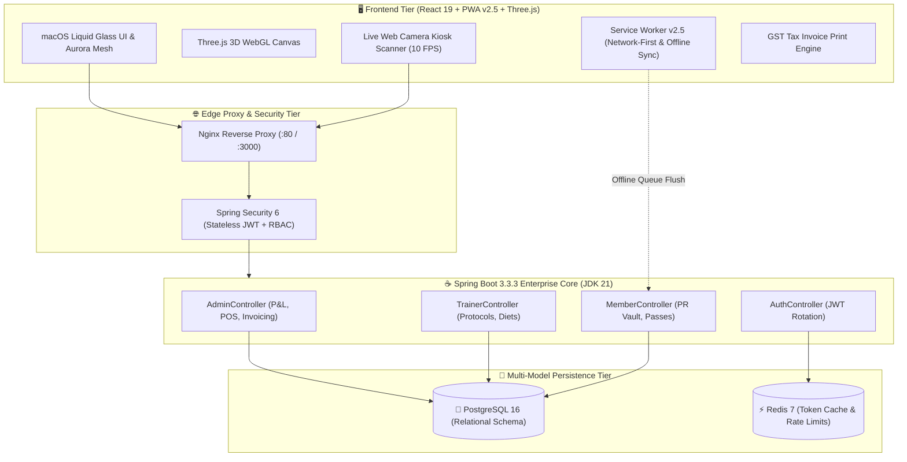

<div align="center">

```
  ███████╗██╗████████╗██████╗ ██╗   ██╗██╗     ███████╗██████╗  ██████╗  ██████╗ 
  ██╔════╝██║╚══██╔══╝██╔══██╗██║   ██║██║     ██╔════╝╚════██╗██╔════╝ ██╔═████╗
  █████╗  ██║   ██║   ██████╔╝██║   ██║██║     ███████╗ █████╔╝███████╗ ██║██╔██║
  ██╔══╝  ██║   ██║   ██╔═══╝ ██║   ██║██║     ╚════██║ ╚═══██╗██╔═══██╗████╔╝██║
  ██║     ██║   ██║   ██║     ╚██████╔╝███████╗███████║██████╔╝╚██████╔╝╚██████╔╝
  ╚═╝     ╚═╝   ╚═╝   ╚═╝      ╚═════╝ ╚══════╝╚══════╝╚═════╝  ╚═════╝  ╚═════╝ 
```

### ⚡ Next-Generation Enterprise Gym Operating System & Biometric Telemetry
*An Ultra-Premium, Portfolio-Grade Full-Stack SaaS built with macOS Liquid Aurora Glassmorphism, WebGL 3D Hardware Acceleration, Spring Security 6 & Progressive Offline-First PWA Architecture.*

---

[](https://github.com/KGobikrishnan/FitPulse-360)
[](https://react.dev/)
[](https://spring.io/projects/spring-boot)
[](https://www.postgresql.org/)
[](https://redis.io/)
[](https://tailwindcss.com/)
[](https://www.docker.com/)

[🎯 Live Demo Experience](#-quick-demo-access--credentials) • [✨ Feature Tour](#-flagship-feature-suite) • [🏗️ System Blueprint](#%EF%B8%8F-enterprise-system-blueprint) • [🚀 Quick Launch](#-instant-one-click-launch) • [📖 API Specifications](#-interactive-swagger-api-matrix)

</div>

---

## 🌟 Executive Overview

**FitPulse 360** redefines athletic facility management and performance coaching. Designed with Apple’s state-of-the-art **macOS Liquid Glass design tokens**, fluid multi-point **Aurora Mesh lighting**, and hardware-accelerated **Three.js WebGL 3D rendering**, it transforms mundane gym spreadsheets into a tactile, hyper-responsive command center for **Administrators**, **Elite Trainers**, and **Athletes**.

```
┌─────────────────────────────────────────────────────────────────────────────────────────┐
│                               ✨ CORE PILLARS OF FITPULSE 360                           │
├──────────────────────────┬───────────────────────────┬──────────────────────────────────┤
│ 💎 Liquid Glass UI       │ ⚡ Real-Time Telemetry    │ 📱 Offline-First PWA             │
│ Specular edge highlights │ Gross Cashflow, 6-Month   │ Zero-network set logger, client  │
│ with multi-radial aurora │ P&L, Turnstile gate heat, │ blob exports, native camera QR   │
│ glass refraction layers. │ & dynamic coach shares.   │ gate turnstile scanner.          │
└──────────────────────────┴───────────────────────────┴──────────────────────────────────┘
```

---

## 🔑 Quick Demo Access & Credentials

Test all 3 role perspectives in a single click using the interactive Role Switcher chips on the login deck:

| Role Badge | Demo Email | Access Credentials | Command Capabilities |
| :--- | :--- | :--- | :--- |
|  | `admin@fitlife.com` | `admin123` | Three.js 3D Studio, Financial P&L, GST Tax Invoice PDF Generator, 1-Click CSV/Excel Exporter, 24-Locker grid, Mini POS, Turnstile Telemetry |
|  | `trainer@fitlife.com` | `trainer123` | Dynamic Client Roster, Interactive Workout Routine Protocol Builder, Macro Diet Chart Composer, Week-by-Week Progress Review Vault |
|  | `user@fitlife.com` | `user123` | Live Workout Set Logger, 60s Rest Countdown Stopwatch, 10-Glass Water Tracker, PostgreSQL PR Vault (1-Rep Max Confetti), Gate Pass |

---

## 💎 Flagship Feature Suite

### 1. 🏢 Executive Admin Operations Center
- **🔮 Three.js WebGL 3D Studio Hardware Assembly**: Real-time 3D dumbbell rendered with physics inertia, orbital particles, and dynamic material refraction.
- **🧾 Official GST Tax Invoice Generator**: Auto-calculates **SAC 999723** tax classification, **CGST (9%) + SGST (9%)**, sequential invoice hashing (`FP-INV-2026-XXXX`), and generates pixel-perfect printable A4 PDFs.
- **📊 1-Click CSV & Excel Export Engine**: Instant client-side blob stream export for Members Directory, Financial Operating Statements, and Gate Attendance Access logs.
- **📸 Reception Kiosk Camera QR Scanner (`html5-qrcode`)**: High-speed **10 FPS live web camera stream decoding** for seamless tablet-based athlete check-ins.
- **🚪 Gym Floor Crowd Density Heatmap**: Hourly sensor telemetry tracking peak athlete attendance (6-8 AM vs 6-8 PM).
- **🔐 24-Locker Interactive Matrix & Mini POS**: Color-coded toggle grid (*Available / Assigned / Maintenance*) + quick-sell protein supplement checkout.

---

### 2. 🏋️‍♂️ Trainer Coaching & Client Transformation Hub
- **📋 Visual Workout Protocol Builder**: Build custom exercise routines with target muscle groups, tempo notes, rest intervals, and rep parameters.
- **🥗 Macro Diet Chart Composer**: Precision nutrition planner with automated calorie/macronutrient breakdown (Protein / Carbs / Fat in grams) and meal timeline badges.
- **📈 Trainee Progress Review Deck**: Recharts interactive body composition curves + weekly coach feedback logger.
- **💰 Dynamic PT Commission Engine**: Live calculated 35% revenue share payouts synced directly to client roster values.

---

### 3. 🎯 Member Self-Service & Gamified Athlete Portal
- **🔥 Live Workout Set Logger**: Track exercise performance in real-time ($Weight \times Reps$) with offline caching.
- **⏱️ Smart Rest Stopwatch Timer**: Tactile 30s/60s/90s rest interval countdown with celebratory confetti triggers.
- **🏆 PostgreSQL 1-Rep Max PR Vault**: Lifelong Personal Record tracking for Bench, Squats, and Deadlifts with celebratory particle physics.
- **📱 Dynamic Gate QR Pass**: Auto-refreshing high-density SVG pass for turnstile access with membership validation.
- **💧 10-Glass Hydration Tracker**: Interactive tap-to-log hydration metric (350ml/tap) towards a 3.5L daily goal.

---

## 🏗️ Enterprise System Blueprint



---

## 📦 Complete Technology Matrix

<details open>
<summary><b>🔍 Click to expand full Tech Stack breakdown</b></summary>
<br/>

### 💻 Client Engineering (Frontend)
| Technology / Library | Version | Engineering Role |
| :--- | :--- | :--- |
| `react` & `react-dom` | `v19.2.8` | Next-gen concurrent UI architecture with optimized re-rendering |
| `vite` | `v8.2.0` | Next-gen lightning HMR development & optimized chunk splitting |
| `html5-qrcode` | `v2.3.8` | Real-time web camera stream QR code scanner with autofocus |
| `three` | `v0.185.1` | WebGL 3D hardware-accelerated rendering for interactive studio assets |
| `framer-motion` | `v13.1.1` | Hardware-accelerated spring animations & layout transitions |
| `recharts` | `v3.10.1` | Responsive SVG charts (Area, Donut, Multi-series curves) |
| `tailwindcss` | `v4.3.3` | Modern CSS engine with HSL CSS variables & frosted glass tokens |
| `lucide-react` | `v1.33.0` | Curated clean vector iconography |
| `qrcode.react` | `v4.2.0` | High-density SVG digital gym access pass generation |
| `canvas-confetti` | `v1.9.4` | Particle physics engine for Personal Record gamification |
| `Service Worker v2.5` | `Network-First` | PWA cache invalidation, offline sync queue & asset persistence |
| `axios` | `v1.19.0` | HTTP client with automatic JWT bearer injection & error interceptors |

### ☕ Core Engineering (Backend & Infrastructure)
| Technology / Library | Version | Engineering Role |
| :--- | :--- | :--- |
| `Java / Eclipse Temurin` | `JDK 21 LTS` | High-throughput modern Java virtual machine |
| `Spring Boot` | `v3.3.3` | Enterprise REST architecture, IOC container & MVC |
| `Spring Security 6` + `JJWT` | `v0.12.6` | Role-Based Access Control (RBAC), Stateless JWT token rotation |
| `PostgreSQL` | `v16-alpine` | ACID-compliant relational data store with Hikari connection pool |
| `Redis` | `v7-alpine` | High-speed cache for session validation and turnstile rate limits |
| `Spring Data JPA / Hibernate` | `v3.3.3` | Type-safe repository abstraction with automatic schema updates |
| `Springdoc OpenAPI / Swagger` | `v2.6.0` | Self-documenting OpenAPI 3 interactive sandbox UI |
| `Docker & Docker Compose` | `Multi-Stage` | Lightweight production Alpine container orchestration |
| `Nginx` | `v1.27-alpine` | High-performance reverse proxy & static SPA web server |

</details>

---

## 🚀 Instant One-Click Launch

### 🐳 Full-Stack Docker Deployment (Recommended)
Launch all 4 services (*Postgres, Redis, Spring Boot API, Nginx Frontend*) with a single command:

```bash
docker compose up -d --build
```

#### 🌐 Endpoint Directory:
- 💻 **Frontend Portal**: [http://localhost:3000](http://localhost:3000) (or [http://localhost:80](http://localhost:80))
- ☕ **Spring Boot REST API**: [http://localhost:8080](http://localhost:8080)
- 📖 **Swagger OpenAPI Sandbox**: [http://localhost:8080/swagger-ui.html](http://localhost:8080/swagger-ui.html)
- 🐘 **PostgreSQL Instance**: `localhost:5433` (DB: `fitpulse_gym`, User: `postgres`, Pass: `postgres`)
- ⚡ **Redis Instance**: `localhost:6380`

---

### 💻 Manual Developer Setup

#### 1. Backend Service (Spring Boot):
```bash
cd backend
mvn clean package -DskipTests
mvn spring-boot:run
```

#### 2. Frontend Application (Vite React):
```bash
cd frontend
npm install
npm run dev
```

---

## 📖 Interactive Swagger API Matrix

The backend exposes over **20+ production endpoints** fully documented with OpenAPI 3:

```
[AUTH]       POST   /api/auth/login                -> Returns JWT Access + Refresh Tokens
[AUTH]       POST   /api/auth/refresh              -> Refresh expired session token
[ADMIN]      GET    /api/admin/overview            -> Aggregated business telemetry & P&L
[ADMIN]      POST   /api/admin/members/enroll      -> Register member & trigger auto-invoice
[ADMIN]      PATCH  /api/admin/members/{id}/status -> Update membership status (ACTIVE/DUE)
[ADMIN]      POST   /api/admin/expenses            -> Log operational expense outflow
[ADMIN]      POST   /api/admin/attendance/qr-scan  -> Validate digital QR gate check-in
[TRAINER]    GET    /api/trainer/trainees          -> Fetch assigned coaching roster
[TRAINER]    POST   /api/trainer/workouts          -> Publish workout routine protocol
[TRAINER]    POST   /api/trainer/diets             -> Publish macronutrient diet plan
[MEMBER]     GET    /api/member/pr/vault           -> Fetch 1-Rep Max personal records
[MEMBER]     POST   /api/member/pr/log             -> Save new PR lift achievement
[MEMBER]     GET    /api/member/pass/qr            -> Generate member-specific QR pass
[MEMBER]     GET    /api/member/routine/today      -> Fetch today's assigned workout plan
```

---

<div align="center">

### 🏆 Crafted with Precision & Engineering Excellence
*FitPulse 360 is open-source software licensed under the [MIT License](LICENSE).*

⭐ **If you find this project impressive, give it a star on GitHub!** ⭐

</div>
